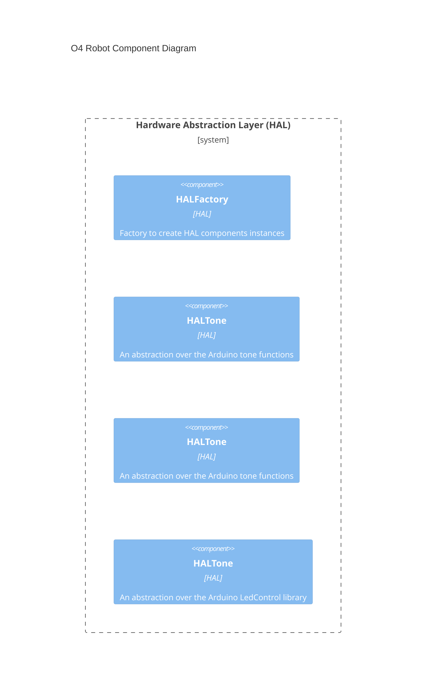

# O4 Firmware

## Introduction

This project contains the firmware for the **O4 Robot**, a tiny 4-legged robot.

### About the O4 Robot

The **O4 Robot** is a tiny 4-legged robot. It is open-source hardware and software.

The O4 Robot is forked from the [OTTO Quad robot](https://github.com/jarsoftelectrical/OTTOquad).

### About `b-code`
`b-code` is a proposal of protocol to control tiny robots like the O4 robot. It is text-based and intended to be the equivalent of G-code for 3D printers and CNC machines.

It is actually not only a protocol, but a set of related projects:
- [b-code-spec](https://github.com/verdi8/b-code-spec/) : the specification of the protocol itself
- [b-code-desc](https://github.com/verdi8/b-code-desc/) : a JSON description format of the capabilities of a robot (possible actions, sensor list, id card) to make it easier to be controlled by generic and reusable remote controls, or even LLMs
- [b-code-remote-control](https://github.com/verdi8/b-code-remote-control/) : a web-based remote control for robots supporting b-code and having a b-code description file
- [b-code-arduino-interpreter](b-code-arduino-interpreter) : an Arduino library to interpret and execute b-code commands

These `b-code` projects are intended to make software developped for the O4 Robot easily reusable for other robots.

> [!NOTE]
> These projects are still in early development, and the specification is not yet stable.

## Installation
This firmware is developed with PlatformIO. The recommanded way to build and install it is to use [Visual Studio Code with the PlatformIO extension](https://docs.platformio.org/en/latest/integration/ide/vscode.html).

### Prerequisites
- [Visual Studio Code](https://code.visualstudio.com/)
- [PlatformIO extension for Visual Studio Code](https://marketplace.visualstudio.com/items?itemName=platformio.platformio-ide)

### Steps
1. Clone this repository
2. Open the folder in Visual Studio Code
3. Connect your O4 Robot to your computer with a USB cable
4. In Visual Studio Code, open the PlatformIO extension (icon on the left sidebar)
5. Click on "Build" to compile the firmware
6. Click on "Upload" to install the firmware on the O4 Robot

## Usage

## Customization

### Hardware configuration
The hardware configuration of the O4 Robot can be customized in the `src/Hardware/Config.h` file. You can change the pin assignments.

### Software guide



### Unit testing
To run the unit tests locally, use the following command in the PlatformIO terminal:
```
pio test
```

A GCC toolchain must be available in your system PATH for the unit tests to run.

By the way, unit tests are also automatically run on GitHub Actions for each pull request.

## Contributing
Contributions are welcome! Please read the [CONTRIBUTING.md](CONTRIBUTING.md) file for more information.